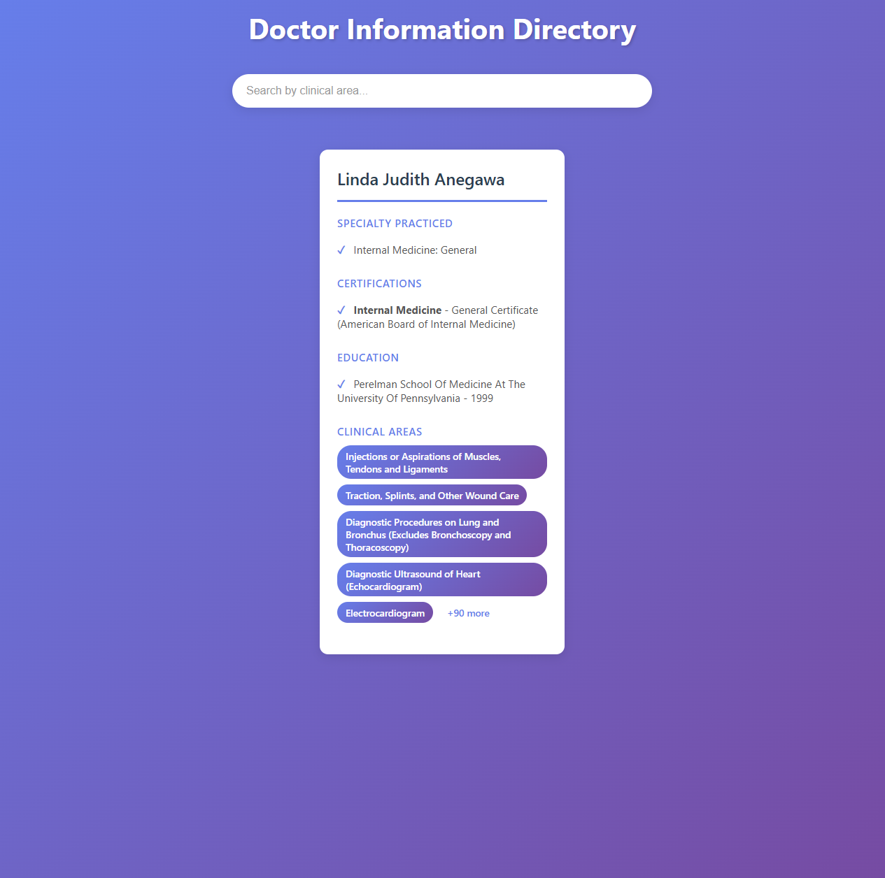
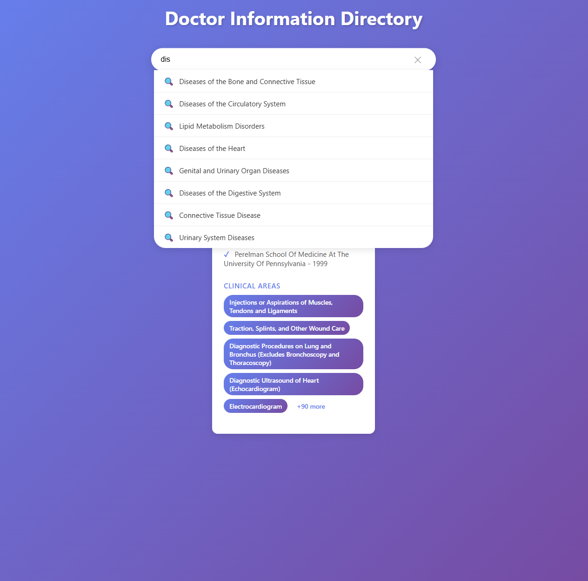

# Doctor Information Directory - React App




A modern React application displaying doctor information with Elasticsearch-like search by clinical areas.

## Quick Start

1. **Install dependencies**
   ```bash
   npm install
   ```

2. **Run the app**
   ```bash
   npm start
   ```

3. **Access the app**
   - Local: http://localhost:3000

## Features

- **DoctorCard Component** - Displays full name, specialty, certifications, education, and clinical areas
- **Smart Search** - Real-time search with autocomplete suggestions for clinical areas
- **Responsive Design** - Works on desktop, tablet, and mobile
- **Modern UI** - Beautiful gradient background with animations

## Project Structure

```
├── App.jsx                          # Main React component
├── App.css                          # Main app styles
├── package.json                     # Project dependencies
├── vite.config.js                   # Vite configuration
├── index.new.html                   # HTML entry point
├── index.new.jsx                    # React entry point
├── doctor_info.json                 # Doctor data
├── components/
│   ├── DoctorCard.jsx              # Doctor card component
│   └── SearchBox.jsx               # Search component with Elasticsearch-like search
└── styles/
    ├── DoctorCard.css              # Doctor card styles
    └── SearchBox.css               # Search box styles
```

## Installation & Setup

1. **Install Dependencies**
   ```bash
   npm install
   ```

2. **Start Development Server**
   ```bash
   npm start
   ```
   The app will automatically open at `http://localhost:5173`

3. **Build for Production**
   ```bash
   npm run build
   ```

## How It Works

### DoctorCard Component
The `DoctorCard` component is a reusable component that accepts a doctor object and renders:
- Doctor's full name
- List of specialties
- Certifications
- Educational background
- Clinical areas with badges

### SearchBox Component
The `SearchBox` component provides:
- Real-time search filtering through clinical areas
- Dropdown suggestions as you type
- Elasticsearch-like text matching (substring matching)
- Highlighting of matching results

### Data Format

The app expects the `doctor_info.json` file to have the following structure:

```json
{
  "fullName": "Doctor Name",
  "specialtyPracticed": ["Specialty 1", "Specialty 2"],
  "certifications": ["Certification 1", "Certification 2"],
  "education": ["Education 1", "Education 2"],
  "clinicalAreas": [
    {
      "name": "Clinical Area Name",
      "score": 85,
      "observations": 1000
    }
  ]
}
```

The app can handle both single doctor objects and arrays of doctors.

## Search Functionality

The search feature implements Elasticsearch-like functionality:

1. **Text Matching**: Searches through all clinical areas using substring matching
2. **Suggestions**: Shows autocomplete suggestions from matching results
3. **Filtering**: Dynamically filters doctors based on search input
4. **Clear**: Quick clear button to reset search

## Customization

### Styling
- Modify colors in CSS files by changing the primary color from `#667eea` to your preferred color
- Update gradients in `App.css` for different background effects

### Adding More Fields
To display additional doctor information:
1. Update the destructuring in `DoctorCard.jsx`
2. Add a new section with appropriate styling
3. Update the doctor data structure in `doctor_info.json`

### Changing Search Behavior
To modify search logic:
1. Edit the `performSearch` function in `SearchBox.jsx`
2. Implement different matching algorithms (e.g., fuzzy search, regex patterns)

## Performance Notes

- The app loads doctor data on component mount
- Search filtering happens client-side for fast performance
- For large datasets (1000+ doctors), consider implementing:
  - Pagination
  - Virtual scrolling
  - Backend search with Elasticsearch

## Browser Support

- Chrome (latest)
- Firefox (latest)
- Safari (latest)
- Edge (latest)

## Technologies Used

- **React 18**: UI library
- **Vite**: Build tool and dev server
- **CSS3**: Styling with animations
- **JavaScript ES6+**: Modern JavaScript features

## Future Enhancements

1. Connect to a real Elasticsearch instance for advanced search
2. Add filtering by specialty, certifications
3. Implement sorting by various criteria
4. Add pagination for large datasets
5. Include doctor ratings and reviews
6. Add appointment booking functionality

## License

MIT
